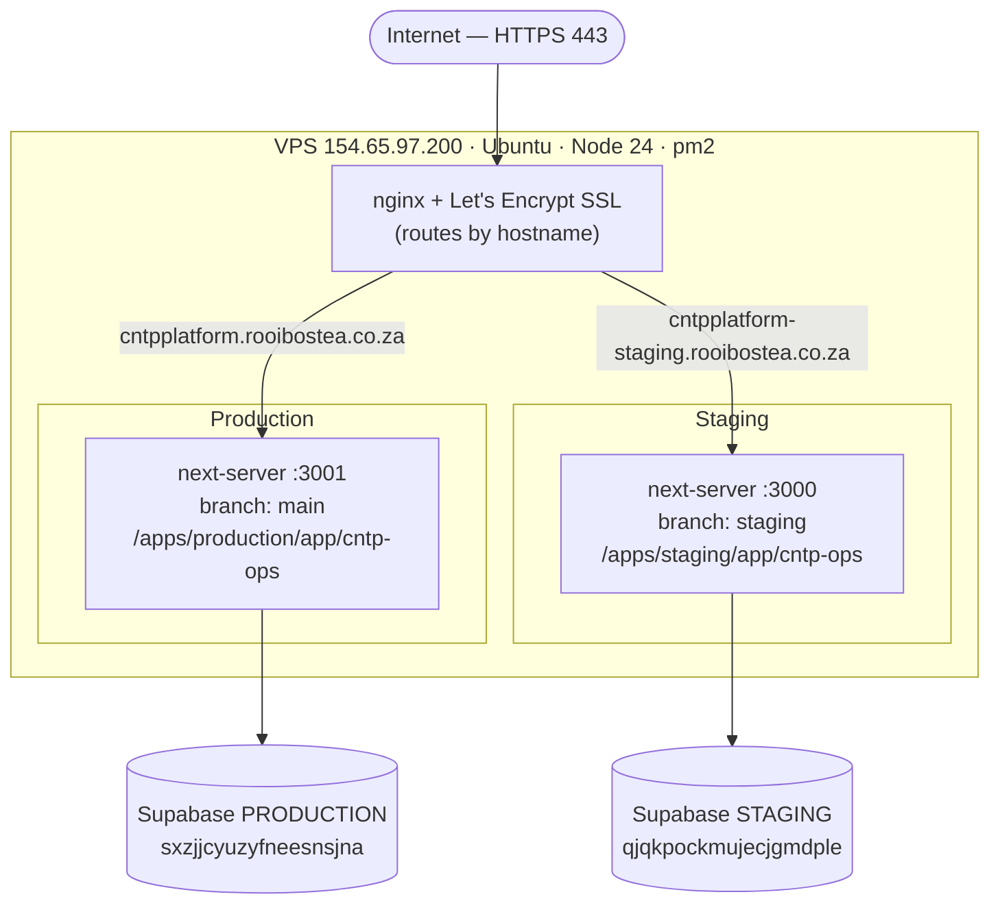
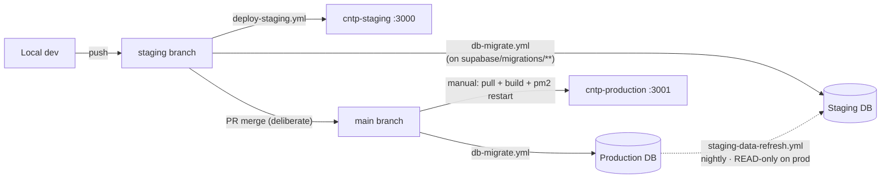
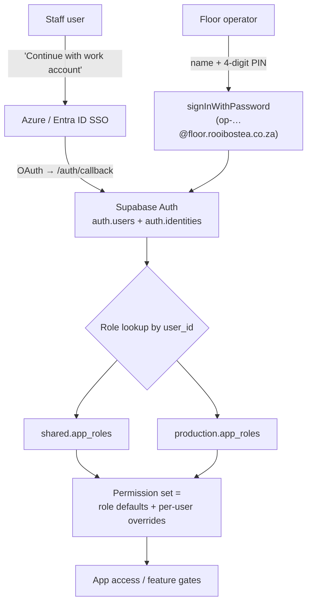

# Environments: Staging & Production Architecture

How the CNTP Platform runs on the VPS, how **staging** and **production** are kept
isolated, and how **users & roles** work. Verified 2026-06-23.

> **TL;DR** — Staging and production are fully separated: different git branch,
> app folder, process, port, nginx vhost, and Supabase project. Work you push to
> `staging` deploys only the staging app and migrates only the staging database.
> Production changes **only** when you deliberately merge to `main`. No shared
> state, so staging work cannot affect production users and causes no downtime.

---

## 1. At a glance

| Layer | Staging | Production |
|---|---|---|
| Public URL | `https://cntpplatform-staging.rooibostea.co.za` | `https://cntpplatform.rooibostea.co.za` |
| Git branch | `staging` | `main` |
| App folder (VPS) | `/home/cntpdev/apps/staging/app/cntp-ops` | `/home/cntpdev/apps/production/app/cntp-ops` |
| Process (pm2) | `cntp-staging` | `cntp-production` |
| Local port | `:3000` | `:3001` |
| nginx vhost | `cntpplatform-staging` | `cntpplatform` |
| Supabase project | `qjqkpockmujecjgmdple` | `sxzjjcyuzyfneesnsjna` |
| Deploy trigger | push to `staging` → auto | merge to `main` → **manual** deploy |

Both apps run as user `cntpdev`, on Node v24.16.0 (via NVM), kept alive by pm2
(auto-start on reboot), behind a single nginx that terminates SSL (Let's Encrypt).

---

## 2. Runtime / network architecture



- One nginx instance reverse-proxies each hostname to the matching local port.
- Only two vhosts are enabled (`cntpplatform`, `cntpplatform-staging`); other
  files in `sites-available` (`default`, `*.save`, `*.bak`) are inactive backups.
- Each app is a standalone Next.js production build (`next-server`) with its own
  `.env.local` pointing at its own Supabase project.

---

## 3. CI/CD and data flow



**The rules that guarantee isolation:**

- **`deploy-staging.yml`** — on a push to `staging`, SSHes in, `cd`s into the
  *staging* folder, `git pull origin staging`, builds, restarts **cntp-staging**.
  It never touches the production folder or process.
- **`db-migrate.yml`** — push to `staging` applies migrations to the **staging**
  DB; only a push to **`main`** applies them to the **production** DB.
- **`staging-data-refresh.yml`** — nightly, copies real `qms` data
  **production → staging** (so staging tests against recent data). It only *reads*
  prod and *reloads* staging; production is never written.

**Schema up, data down:** schema changes flow dev → staging → (merge) → prod via
migrations; real data flows prod → staging via the nightly refresh. Production is
the single writer of production data.

> ⚠️ Consequence to remember: changes you make to `qms` **data** in staging are
> overwritten nightly from production. Staging is for testing *behaviour*, not for
> holding data you need to keep.

---

## 4. Users & roles

Authentication and authorisation are the **same application code** in both
environments — only the data (the user list and their role rows) lives in each
environment's own Supabase project.



- **Staff** sign in with their Microsoft **work account** (Azure SSO). On
  successful sign-in, Supabase matches the user via `auth.identities`; their role
  is read from `app_roles` and resolved into a permission set
  (role defaults + sparse per-user overrides).
- **Floor operators** use a name + 4-digit PIN that maps to a hidden
  `op-…@floor.rooibostea.co.za` account (separate from staff SSO).
- Role definitions and the permission registry live in `lib/auth/`
  (`permissions.ts`, `permission-registry.ts`, `context.tsx`,
  `server-helpers.ts`). New users/roles are provisioned in-app at `/admin/users`.

**Does it work the same way in production as staging?** **Yes — identical
mechanism.** The login flow, role tables (`shared.app_roles` +
`production.app_roles`), permission resolution, and Azure SSO config are the same
on both. As of 2026-06-23 the production user list and roles were reconciled to
match staging's model (real staff on Azure SSO, each with their role). The only
gaps are *unrelated* features staging has ahead of `main` (shift roster, staff
directory) — they do not touch authentication or permissions.

---

## 5. Deploy procedures

**Staging (automatic):**
```bash
git checkout staging && git pull origin staging
git checkout -b alyssa/my-change
# …edit…
git commit -am "what changed and why"
git push origin HEAD          # open PR → squash-merge to staging → deploy-staging.yml runs
```

**Production (deliberate, manual):**
```bash
# 1. Promote code: merge staging → main (PR). This triggers db-migrate.yml against PROD.
# 2. Deploy the app on the VPS:
ssh -p 2022 cntpdev@154.65.97.200 '
  export NVM_DIR="$HOME/.nvm" && source "$NVM_DIR/nvm.sh"
  cd /home/cntpdev/apps/production/app/cntp-ops
  git pull origin main
  npm run build 2>&1 | tail -15
  /home/cntpdev/.nvm/versions/node/v24.16.0/bin/pm2 restart cntp-production
'
```

---

## 6. Safety notes & known risks

1. **Promotion to `main` is the moment to be careful.** Merging to `main` runs
   `supabase db push` against the **production** DB. The repo migration history is
   known to be partial/un-baselined, so review pending migrations before merging.
   Consider gating the prod-migration path behind an explicit confirmation.
2. **Manual `workflow_dispatch`** on `db-migrate.yml` targets a DB by branch —
   dispatching it from `main` hits production. Don't dispatch it from `main`
   casually.
3. **Credential hygiene:** the VPS clones currently embed a GitHub personal access
   token in `remote.origin.url`. Rotate it and switch to a credential helper or a
   read-only deploy key.
4. **No `deploy-production.yml`** exists — production app deploys are manual by
   design, which keeps production stable and unaffected by routine staging work.
